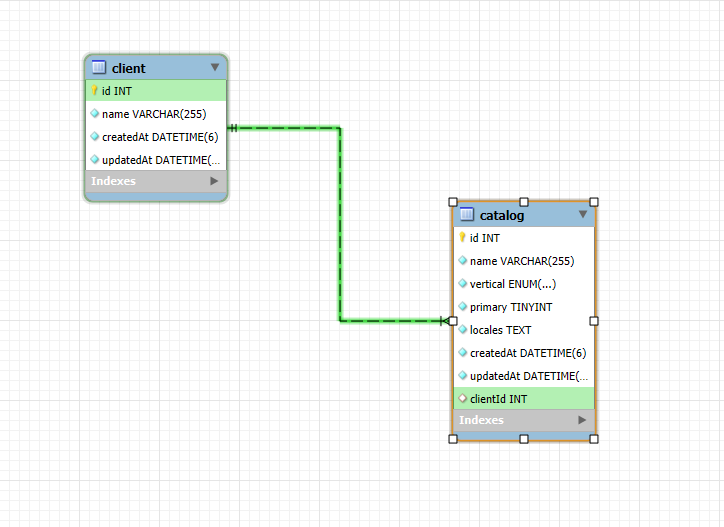

# 📌 Project Documentation

## 📂 Project Structure
```
/ (project root)
│   ├── src/
│   │   ├── app.module.ts            # Root module of the application
│   │   ├── main.ts                  # Application entry point; bootstrap function
│   │   │
│   │   ├── clients/                 # Client management module
│   │   │   ├── client.module.ts     # Client module definition
│   │   │   ├── client.controller.ts # Handles HTTP requests for clients
│   │   │   ├── client.service.ts    # Business logic for client operations
│   │   │   ├── dto/                 # Data Transfer Objects for clients
│   │   │   ├── swagger/             # Swagger definitions for client endpoints
│   │   │   └── __test__/                # Unit and integration tests for clients
│   │   │
│   │   ├── catalogs/                # Catalog management module
│   │   │   ├── catalog.module.ts     # Catalog module definition
│   │   │   ├── catalog.controller.ts # Handles HTTP requests for catalogs
│   │   │   ├── catalog.service.ts    # Business logic for catalog operations
│   │   │   ├── dto/                 # Data Transfer Objects for catalogs
│   │   │   ├── swagger/             # Swagger definitions for catalog endpoints
│   │   │   └── __test__/                # Unit and integration tests for catalogs
│   │   │
│   │   └── database/                # Database configuration and entities
│   │       ├── database.module.ts   # Database connection module
│   │       └── entities/            # TypeORM entities
│   │           ├── client.entity.ts # Client entity definition
│   │           └── catalog.entity.ts # Catalog entity definition
│   │
│   ├── test/                        # Global test files (if needed)
│   ├── Dockerfile                   # Dockerfile for building the container image
│   ├── docker-compose.yml            # Docker Compose configuration for app & MySQL
│   ├── package.json                  # Project dependencies and scripts
│   ├── tsconfig.json                 # TypeScript configuration
│   └── .env                         # Environment variable configuration file
│   └── _env_example                 # Example of .env configuration file
```

## Entity-Relationship Diagram (ERD)

The following diagram represents the database structure, showing the relationship between the `client` and `catalog` tables.

- The `client` table stores information about clients.
- The `catalog` table stores catalog data and references a client via the `clientId` foreign key.
- Each catalog belongs to a single client.

### ERD Diagram




## ⚙️ Installing Dependencies
From the project root directory, run:

```bash
npm install
```
## 🔑 .env File
You need to copy the _env_example file and rename it to .env in the project root directory.
This file will contain the environment variables necessary for the application, such as:
```
DATABASE_HOST – The database host
DATABASE_PORT – The database port
DATABASE_USER – The database username
DATABASE_PASSWORD – The database password
DATABASE_NAME – The name of the database
 ```
## 🚀 Running the Application

### 🛠️ Without Docker

1. **Ensure MySQL is Running**:  
   If you’re not using Docker, make sure you have a MySQL server running and that the connection parameters in the `.env` file are correct.

2. **Run the Application**:  
   ```bash
   npm run start
   ```
3. **Access the API Documentation**:  
   Open your browser at [http://localhost:3000/api](http://localhost:3000/api) to view the Swagger UI.

### 🐳 With Docker
The project includes a `Dockerfile` and `docker-compose.yml` for containerized execution.

1. **Build and Run Containers**:  
   ```bash
   docker-compose up --build
   ```

2. **Docker Container Details**:
   - `nestjs_app`: The NestJS application container.
   - `mysql_db`: The MySQL database container.

3. **Access the API Documentation**:  
   Visit [http://localhost:3000/api](http://localhost:3000/api) after the containers have started.

## 🧪 Running Tests
Testing ensures that your application functions correctly.

- **Run All Tests**:
  ```bash
  npm run test
  ```
- **Watch Mode (Auto-run on file changes)**:
  ```bash
  npm run test:watch
  ```
- **Test Coverage Report**:
  ```bash
  npm run test:cov
  ```

## 📌 API Endpoints Overview
The API supports operations for managing clients and catalogs.

### 🧑‍💼 Clients Endpoints
| Method | Endpoint | Description |
|--------|---------|-------------|
| **POST** | `/clients` | Create a new client |
| **GET** | `/clients` | Retrieve all clients |
| **GET** | `/clients/:id` | Get client details by ID |
| **PUT** | `/clients/:id` | Update client information |
| **DELETE** | `/clients/:id` | Delete a client |

### 📦 Catalogs Endpoints
| Method | Endpoint | Description |
|--------|---------|-------------|
| **POST** | `/clients/:clientId/catalogs` | Create a new catalog. If marked as primary, it demotes the existing primary catalog for the same vertical. |
| **GET** | `/clients/:clientId/catalogs` | Retrieve all catalogs for a specific client. Response includes an `isMultiLocale` flag. |
| **PUT** | `/clients/:clientId/catalogs/:catalogId` | Update catalog details, e.g., setting primary or updating locales. If updated to primary, the existing primary is automatically updated. |
| **DELETE** | `/clients/:clientId/catalogs/:catalogId` | Delete a specific catalog. |
| **DELETE** | `/clients/:clientId/catalogs` (Bulk Delete) | Delete multiple catalogs by providing an array of catalog IDs. |

## 📖 Swagger Documentation
The API includes Swagger integration for interactive documentation.

- **Access Swagger UI**:
  ```bash
  http://localhost:3000/api
  ```
- **Features**:
  - Detailed request/response models
  - Endpoint parameters
  - Sample payloads

---